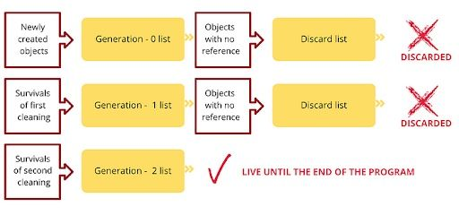

# Garbage Collection
## Generational Garbage Collection
- a type of trace-based garbage collection
- can break cyclic references and delete unused objects which are referencing themselves : referenced in [GIL](python-gil.md)
### How
- Python keeps track of every object in memory
- 3 lists are created (Generation 0, 1, 2) when program is run
- Newly created objects are put in the Generation 0 list. A list is created for objects to be discarded. Reference cycles are detected. If an object has no outside references, it’s discarded. The objects that survived this process are put in the Generation 1 list. The same steps are applied to the Generation 1 list. Survivals from the Generation 1 list are put in the Generation 2 list. The objects in the Generation 2 list stay there until the end of the program execution.
